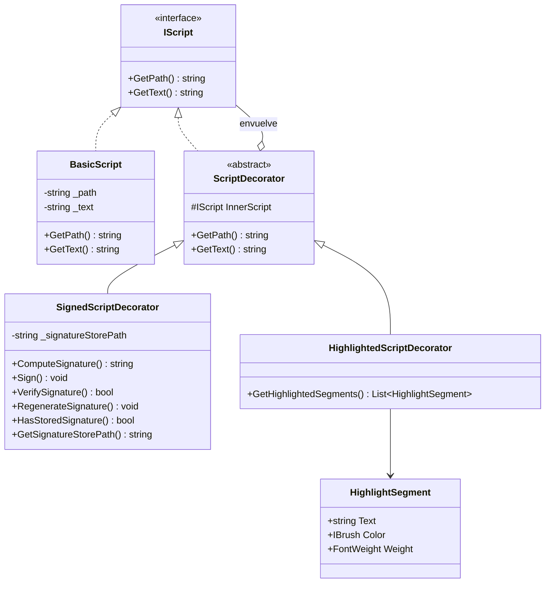

# Patron Decorator aplicado al objeto Script

## Objetivo

Esta parte implementa el patron Decorator sobre un objeto `Script` de Python. La idea es tener un objeto base simple que conoce la ruta y el texto del archivo, y luego agregar funcionalidades opcionales sin modificar esa clase base.

Las funcionalidades agregadas son:

- Firma digital local del contenido del script.
- Verificacion de integridad para detectar cambios externos.
- Regeneracion de firma cuando se acepta una nueva version del archivo.
- Visualizacion del texto con syntax highlight.

## Clases principales



## Como se aplica el patron

`IScript` define las operaciones minimas que cualquier script debe tener: devolver su ruta y devolver su texto.

`BasicScript` es el componente concreto. Representa un script normal de Python cargado desde disco. Guarda la ruta del archivo y lee su contenido.

`ScriptDecorator` es el decorador base. Tambien implementa `IScript`, pero en lugar de representar el archivo directamente, recibe otro `IScript` por composicion. Sus metodos delegan al objeto interno.

`SignedScriptDecorator` agrega comportamiento de firma. Calcula un hash SHA-256 del contenido actual del archivo, guarda la firma en un CSV local y permite verificar si el archivo actual coincide con la firma guardada. Si el archivo cambia fuera de la aplicacion, la verificacion falla.

`HighlightedScriptDecorator` agrega comportamiento visual. Toma el texto del script y lo convierte en segmentos con color para representar syntax highlight de Python.

La ventaja del Decorator es que las funcionalidades se pueden combinar sin cambiar `BasicScript`. Por ejemplo:

```csharp
IScript script = new BasicScript(path);
var signedScript = new SignedScriptDecorator(script);
var highlightedScript = new HighlightedScriptDecorator(script);
```

## Flujo de la interfaz grafica

La pantalla de demostracion se encuentra en:

`src/ClientLocal/Views/Decorator/DecoratorDemoView.axaml`

Permite:

- Cargar un archivo `.py`.
- Ver el texto original.
- Ver el texto con syntax highlight.
- Firmar el script por primera vez.
- Verificar si la firma sigue siendo valida.
- Regenerar la firma si se acepta una modificacion externa.

Para abrir solamente esta demo se puede ejecutar:

```powershell
cd C:\xampp\htdocs\ProyectoFinalDS
dotnet run --project .\src\ClientLocal\ClientLocal.csproj -- --decorator-demo
```

## Prueba realizada

1. Se cargo el archivo `samples/decorator/demo_script.py`.
2. La aplicacion mostro el texto original del script.
3. La aplicacion mostro el script con syntax highlight.
4. Se presiono `Firmar` y se guardo la firma local.
5. Se presiono `Verificar Firma` y la firma fue valida.
6. Se modifico el archivo desde Notepad, cambiando texto dentro del script.
7. Se presiono `Verificar Firma` y la aplicacion detecto que el archivo habia cambiado fuera de la aplicacion.
8. Se presiono `Regenerar Firma` para aceptar la nueva version del archivo.
9. Se verifico nuevamente y la firma volvio a ser valida.

## Diferencia entre Firmar y Regenerar Firma

`Firmar` se usa para crear la primera firma del script. Si ya existe una firma guardada, no la reemplaza automaticamente.

`Regenerar Firma` se usa cuando el archivo cambio y el usuario decide aceptar esa nueva version como valida. En ese caso se reemplaza la firma anterior por una firma nueva.

Esta separacion evita que el boton de firmar oculte accidentalmente una modificacion externa.

## Archivos implementados

- `src/ClientLocal/Services/Decorator/IScript.cs`
- `src/ClientLocal/Services/Decorator/BasicScript.cs`
- `src/ClientLocal/Services/Decorator/ScriptDecorator.cs`
- `src/ClientLocal/Services/Decorator/SignedScriptDecorator.cs`
- `src/ClientLocal/Services/Decorator/HighlightedScriptDecorator.cs`
- `src/ClientLocal/Services/Decorator/HighlightSegment.cs`
- `src/ClientLocal/Views/Decorator/DecoratorDemoView.axaml`
- `src/ClientLocal/Views/Decorator/DecoratorDemoView.axaml.cs`
- `src/ClientLocal/Views/Decorator/DecoratorHostWindow.axaml`
- `src/ClientLocal/Views/Decorator/DecoratorHostWindow.axaml.cs`

## Conclusiones

El patron Decorator permite extender el comportamiento de `Script` sin modificar el componente base. En esta solucion, la firma y el syntax highlight se agregan como capas independientes, lo que mantiene el codigo mas flexible y facil de extender.

La verificacion de firma permite detectar modificaciones externas al archivo, cumpliendo con el requerimiento de integridad. El syntax highlight demuestra otra extension opcional aplicada al mismo objeto base.
